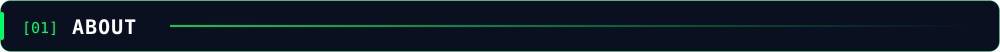
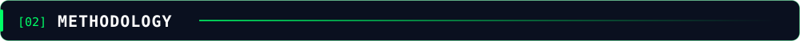

  
  
  
  

I'm building my path in **Cybersecurity**, focused on understanding how systems, networks and applications can be analyzed, tested and protected.

This profile is my **living security laboratory**: a place to document what I learn, build controlled experiments and turn theory into technical understanding.

> **Learn the attack. Understand the defense. Build better security.**

`Reconnaissance` › `Enumeration` › `Analysis` › `Validation` › `Documentation` › `Remediation`

> [!WARNING]
> Security testing is performed **only** in authorized laboratories, CTFs and controlled environments.

| 🗡️ Offensive | 🛡️ Defensive | 🛰️ Intelligence | 🧱 Infrastructure |
| :---: | :---: | :---: | :---: |
| Penetration Testing | Threat Detection | OSINT | Kali Linux |
| Reconnaissance | Network Monitoring | Information Gathering | Linux |
| Enumeration | Log Analysis | Digital Footprinting | Networking |
| Web Security | Incident Analysis | Threat Intelligence | Virtualization |
| Red Team | Security Hardening | Security Research | Security Infrastructure |

 

| Project | Objective |
| :-- | :-- |
| 🛰️ **OSINT Toolkit** | Practical tools for information gathering |
| 🔎 **Recon Automation** | Automate selected reconnaissance workflows |
| 🌐 **Web Security Lab** | Study web security in controlled environments |
| 🐧 **Linux Security Lab** | Linux hardening and security experiments |
| 🐍 **Python Security Toolkit** | Security-focused Python utilities |
| 📡 **Network Analysis Lab** | Network traffic and analysis techniques |
| 🛡️ **Defensive Security Lab** | Detection, monitoring and hardening experiments |

<picture>
  <source media="(prefers-color-scheme: dark)" srcset="https://raw.githubusercontent.com/Wendhausen999/Wendhausen999/output/github-snake-dark.svg" />
  <source media="(prefers-color-scheme: light)" srcset="https://raw.githubusercontent.com/Wendhausen999/Wendhausen999/output/github-snake.svg" />
  
</picture>

- [x] Build a strong foundation in cybersecurity
- [ ] Improve Linux and networking knowledge
- [ ] Develop practical reconnaissance skills
- [ ] Study web application security
- [ ] Build security automation tools
- [ ] Understand offensive and defensive methodologies
- [ ] Document technical experiments and findings
- [ ] Develop projects through controlled labs and CTFs

> **Understand systems before attacking them.**  
> **Test only what you are authorized to test.**  
> **Document what you learn.**  
> **Use knowledge to build better security.**

